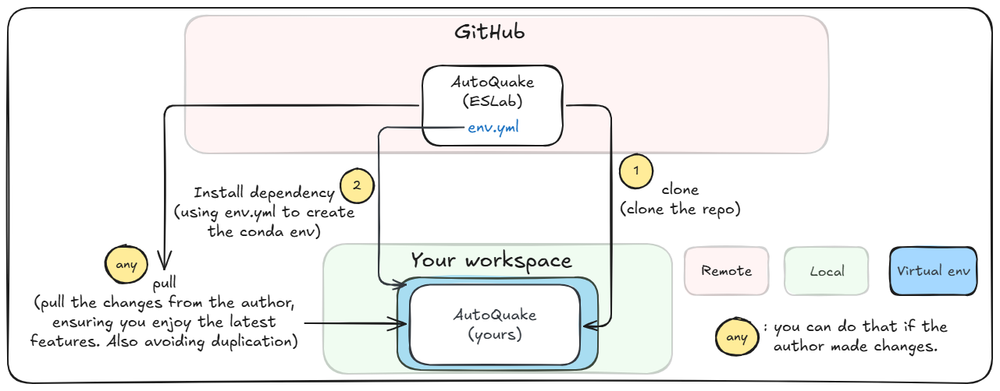
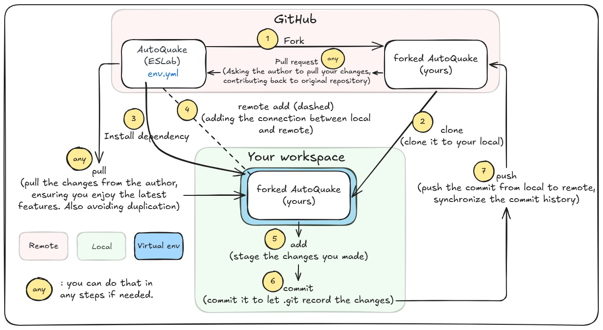

# AutoQuake

> **AutoQuake: An Automated, All-in-One Solution for Earthquake Catalog Generation.**: An object-oriented package that integrates each step of generating an earthquake catalog. The package connects each step as an object, making it easy to manage and streamline the process.

---

## Table of Contents
- [Getting Started](#getting-started)
- [Installation](#installation)
- [Dataset Structure (both hdf5 for DAS and SAC for Seismometer)](#dataset-structure-both-hdf5-for-das-and-sac-for-seismometer)
- [Contributing](#contributing)
- [Roadmap](#roadmap)
- [License](#license)
- [Submodules and External Dependencies](#submodules-and-external-dependencies)
- [References](#references)
- [Contact](#contact)

---

## Getting Started
To get started with this project, choose the scenario that best describes your needs:

### 🚀 Quick Demo (Try the Demo Notebook)
Want to quickly explore AutoQuake without any setup? You have two options:

**Option 1: GitHub Codespace (Recommended for Quick Testing)**

1. Click the green "Code" button → "Codespaces" → "Create codespace on main"
2. Once the codespace loads, open `demo_autoquake.ipynb` and start exploring!

**Option 2: Clone and Run Locally**
```bash
git clone https://github.com/IES-ESLab/AutoQuake.git
cd AutoQuake
# Follow installation steps below, then open demo_autoquake.ipynb
```

### Scenario 1: Preliminary Users (Use Only)

If you only want to use the package without contributing to the codebase, follow these simple steps:

1. **Clone the repository and init the submodules (both HTTPS or SSH is fine)**:
   ```bash
   git clone git@github.com:IES-ESLab/AutoQuake.git
   cd AutoQuake
   ./init_submodules.sh # use sh to execute the script if powershell.
   ```
2. **Install dependecies**: Follow the installation instructions in the [Installation](#installation) section.       
**Use the Package**: Follow the instructions in the Usage section to start generating earthquake catalogs.       
**Report Issues**: If you encounter any problems or have suggestions for improvement, please [open or report an issue](https://github.com/IES-ESLab/AutoQuake/issues). Describe the problem in detail to help us address it quickly.        
**Pull Updates**: Regularly pull updates from the original repository to keep your local copy synchronized and avoid conflicts.
   ```bash
   git pull origin main
   ```
### Scenario 2: Contributors (Recommended. Develop and Improve)

If you’re interested in contributing to the development of this project, follow these steps:

1. **Fork the repository**: Visit the GitHub page of the repository and click on "Fork" to create your own copy.
2. **Clone your forked repository and init the submodules (both HTTPS or SSH is fine)**:
   ```bash
   git clone https://github.com/your-username/AutoQuake.git # clone the dev branch
   cd AutoQuake
   ./init_submodules.sh # use sh to execute the script if powershell.
   ```
3. **Install dependecies**: Follow the installation instructions in the [Installation](#installation) section.
4. **Adding remote for original repository**: Connect your local repository to the original (upstream) repository to fetch updates.    
   ```bash
   git remote add upstream https://github.com/IES-ESLab/AutoQuake.git
   ```
5. **Make your changes**:
   ```bash
   git add .
   ```
6. **commit** them:
   ```bash
   git commit -m "Description of your changes"
   ```
7. **Push your changes** when you want to update the remote repo on GitHub:
   ```bash
   git push origin main
   ```
**Pull Updates**: Regularly pull updates from the original repository to keep your local copy synchronized and avoid conflicts.
   ```bash
   git pull upstream main
   ```
**Open a Pull Request**: Once your changes are pushed, go to the original repository on GitHub and open a Pull Request from your branch to the dev branch of the main repository.
Read to our [Contributing](#contributing) section for more details on how to contribute to this project.       
**Report Issues**: You can help resolving the issues.    

---

## Installation
This package supports both `requirements.txt` and `env.yml` for dependency management. Choose one of the following installation methods:    

### 1. Using Conda (`env.yml`, recommended)
If you’re using Conda, create a new environment directly from the provided `env.yml` file:
   ```bash
   conda env create -f env.yml
   conda activate AutoQuake_v0
   ```
   
### 2. Using pip (`requirements.txt`)
To install dependencies using `pip`:
   ```bash
   pip install -r requirements.txt
   ```

## Dataset Structure (Different data format in different data directory)
**Important**: For the package to function correctly, the dataset must follow a specific directory structure. Ensure your data is organized as follows:    
For seismometer:    
   ```bash
   /data_parent_dir/
    ├── \*YYYYMMDD\*/         # data folder should contain the Year-Month-Day format for glob. 
    │   └── waveform.SAC      # Waveform data in SAC format
   ```
For DAS:    
   ```bash
   /datat_parent_dir/
    ├── \*YYYYMMDD\*/          
    │   └── MiDAS_20240402_86100_86400.h5      # Waveform data in h5 format
   ```
<!-- ## Usage
This package includes a Sphinx-generated documentation site and a Jupyter Notebook for a step-by-step guideline.     
###  Documentation
The documentation includes:
- **Installation and Setup Guide**: Step-by-step instructions for setting up and using the package.
- **API Reference**: Detailed explanations of each class, method, and function.
- **Workflow Examples**: Usage examples demonstrating how to generate an earthquake catalog from start to finish.

To build the Sphinx documentation locally, run:
```bash
cd docs
make html
```
The documentation will be generated in `docs/_build/html` and can be opened in a browser.
## Contributing
We encourage developers to contribute to this project. Here’s a quick guide:

1. **Fork the repository** and **clone your fork** (recommended to work with the dev branch).
2. **Create a new branch** for your feature or bug fix.
3. **Make changes** and **commit** them.
4. **Push to your branch** and **open a Pull Request** to the `dev` branch. -->
## Roadmap
Here are the planned future improvements for this project:

-  **Refactoring Fortrans into Python**: Replace existing Fortran code with Python implementations for better maintainability and compatibility.
-  **Integration with Existing Tools**: Integrate with popular seismic data processing tools and platforms.

The roadmap can adapt based on user feedback and new technology developments. If you’re interested in contributing to any of these features, check the [Contributing](#contributing) section.
## License
This project is licensed under the MIT License, which allows for reuse, modification, and distribution with minimal restrictions. See the [LICENSE](./LICENSE) file for the full MIT License text.

### Submodule Licenses
This repository includes third-party submodules and model with their own licensing terms:
1. **GaMMA** - MIT License: Permissive license allowing free use, modification, and distribution.
2. **EQNet** - Academic and Commercial License:
   - This submodule is available for academic and research use only. For commercial use, a separate license is required. Contact the authors for more information.
   - Users must provide proper attribution in any publications resulting from its use.
3. **DiTing-FOCALFLOW** - Announcements:
   - Users are free to make modifications to the programs to meet their particular needs, but are discouraged from distributing modified code to others without notification of the authors. If you find any part of the workflow useful, please cite our work or the corresponding publications of the packages.

   - Dr. Xiao zhuowei designed and trained the DiTingMotion model,Dr. Zhang Miao provided the data download and preprocessing scripts,Zhao Yanna helped on obtaining and using the HASHpy2 code. Questions and comments? Email Ming Zhao (mn244224@dal.ca)

Please review each submodule’s `LICENSE` file for detailed terms.
## Submodules and External Dependencies
This project relies on the following external repositories as submodules:
1. [**EQNet**](https://github.com/IES-ESLab/EQNet): A forked repository contains the PhaseNet, PhaseNet-DAS.
2. [**GaMMA**](https://github.com/IES-ESLab/GaMMA): A forked repository contains the Gaussian Mixture Model for Earthquake Detection and Location.
3. [**DataClient**](https://github.com/IES-ESLab/Fetch_data): A helper for fetching data through IESWS and GDMS, accout and password are needed.
## References
- Yang, H.-Y., Huang, H.-H., Wu, E.-S., Chen, H.-A., Liu, C.-N., Hsu, Y.-F., Liang, W.-T., & Ku, C.-S (2025). **An ML-Enhanced Earthquake Catalog for the 2024 MW 7.4 Hualien Earthquake Sequence: Insights into Structural Transition from Collision to Subduction in Eastern Taiwan.** Manuscript under review.
- Huang, H. H., Wu, Y. M., Song, X., Chang, C. H., Lee, S. J., Chang, T. M., & Hsieh, H. H. (2014). [**Joint Vp and Vs tomography of Taiwan: Implications for subduction-collision orogeny.**](https://www.sciencedirect.com/science/article/pii/S0012821X14000995?via%3Dihub) Earth Planet Science Letters, 392, 177–191. https://doi.org/10.1016/j.epsl.2014.02.026
- Hsu, Y. F., Huang, H. H., Huang, M. H., Tsai, V. C., Chuang, R. Y., Feng, K. F., & Lin, S. H. (2020). [**Evidence for Fluid Migration During the 2016 Meinong, Taiwan, Aftershock Sequence.**](https://agupubs.onlinelibrary.wiley.com/doi/full/10.1029/2020JB019994) Journal of Geophysical Research: Solid Earth. 125. 10.1029/2020JB019994.
- Wu, Y. M., Zhao, L., Chang, C. H., & Hsu, Y. J. (2008). [**Focal-Mechanism Determination in Taiwan by Genetic Algorithm.**](https://pubs.geoscienceworld.org/ssa/bssa/article/98/2/651/350113/Focal-Mechanism-Determination-in-Taiwan-by-Genetic). Bulletin of the Seismological Society of America 2008;; 98 (2): 651–661. doi: https://doi.org/10.1785/0120070115
- Zhao, M., Xiao, Z., Zhang, M., Yang, Y., Tang, L., & Chen, S. (2023). [**DiTingMotion: A deep-learning first-motion-polarity classifier and its application to focal mechanism inversion.**](https://www.frontiersin.org/journals/earth-science/articles/10.3389/feart.2023.1103914/full) Frontiers in Earth Science, 11, 335.https://doi.org/10.3389/feart.2023.1103914
- Zhu, W., & Beroza, G. C. (2019). [**PhaseNet: A Deep-Neural-Network-Based Seismic Arrival Time Picking Method.**](https://academic.oup.com/gji/article/216/1/261/5129142) Geophysical Journal International, Volume 216, Issue 1, January 2019, Pages 261–273, https://doi.org/10.1093/gji/ggy423
- Zhu, W., McBrearty, I. W., Mousavi, S. M., Ellsworth, W. L., & Beroza, G. C. (2022). [**Earthquake Phase Association using a Bayesian Gaussian Mixture Model.**](https://agupubs.onlinelibrary.wiley.com/doi/full/10.1029/2021JB023249) Journal of Geophysical Research: Solid Earth, 127, e2021JB023249. https://doi.org/10.1029/2021JB023249
- Zhu, W., Biondi, E., Li, J., Yin, J., Ross, Z. E., & Zhan, Z. (2023). [**Seismic arrival-time picking on distributed acoustic sensing data using semi-supervised learning.**](https://www.nature.com/articles/s41467-023-43355-3) Nat Commun 14, 8192. https://doi.org/10.1038/s41467-023-43355-3
## Contact
If you have any questions or suggestions, feel free to reach out:
- **Email**: [patrick.yang880612@gmail.com](mailto:patrick.yang880612@gmail.com)
- **GitHub**: [@Pamicoding](https://github.com/Pamicoding)

